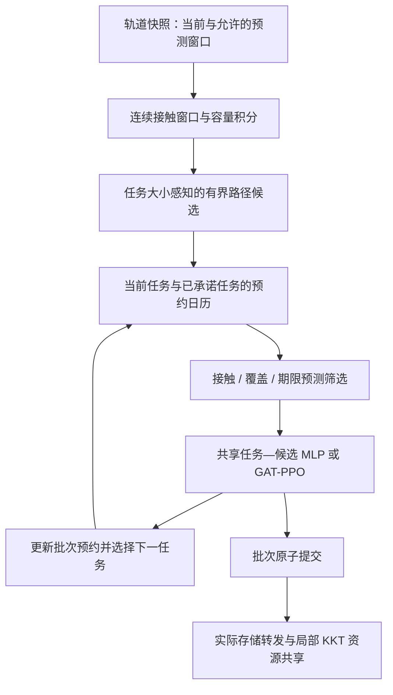

# 接触窗口候选、预约筛选与跨规模 Graph PPO

2026-10-05 的代码升级说明。推荐配置是 `configs/contact_ppo.yaml`，训练环境不需要新增依赖。

## 1. “接触窗口感知候选”是什么

同一条链路“现在存在”并不说明大任务能在断开前传完。例如链路还有 2 s、速率 100 Mbit/s：100 Mbit 的任务可能通过，300 Mbit 的任务则需要重新选择路径。多跳时还必须递推数据何时到达下一跳，不能只检查所有链路在当前时刻是否存在。

本版将允许读取的轨道快照压缩为连续接触窗口 `[start,end)`，保存窗口容量、结束边界是否已知，并按任务实际数据量积分参考发送速率。候选搜索使用当前图中的无环路径，优先保留未检测到接触中断的路径，再按预计完成时间排序；每个目的星最多 K 条，搜索扩展预算耗尽会显式记录 `search_truncated`。

这是有限预测窗口上的 contact-aware 候选机制，沿用 [NASA CGR](https://ntrs.nasa.gov/citations/20120006508) 的计划接触思想。本版没有实现完整 DTN/CGR：不会等待当前断开的链路未来重新开启，不支持断链重路由，也没有新增缓存容量约束。当前拓扑选边切换同样会形成窗口边界，不能全部解释为物理遮挡。



## 2. 预约驱动筛选的真实边界

`ReservationCalendar` 使用无向边作为链路键，因此双向业务共享同一预约预算。链路发送预约有开始和结束时间，跨快照时积分各快照的参考容量；CPU 预约只能在输入到达后开始。

日历先放入当前 CPU 剩余工作，再按剩余期限、任务 ID 的顺序投影已在传输/传播的任务。当前跳使用剩余 bits，后续跳使用完整输入；CPU 使用剩余 cycles。已经在 CPU 的工作不再作为在途工作重复添加。同一批次按期限选择，每次选中后提交日历预约，再计算下一任务的 mask。

若投影已经检测到某跳发送失败，仅保留到该跳为止的服务预约，不给无法到达的输入追加下游链路或 CPU 占用。

预测日历按参考链路速率和独占 CPU 时间安排资源，实际引擎仍使用处理器共享和平方根分配。它不是执行器的物理服务预留，未来未知任务也可能改变速率。因此名称是**预测接触筛选 / predictive contact shield**，不声称 formal safety 或截止期保证。计算时延下界可用于排除必然不可行任务，不能据此认证其余任务必然成功。[Shielding 的形式化背景](https://ojs.aaai.org/index.php/AAAI/article/view/11797)

推荐配置禁止把预测窗口覆盖不足的远程路径通过 contact shield；`routing.allow_unverified_future=true` 可作为放宽对照。`rl.use_future=false` 设置 H=0，仅使用当前快照并省略覆盖认证条件，不能称为预测认证。全不可行时恢复本地动作，记录 fallback 和预测违约；不将其算作安全选择。

## 3. 开关与消融

| 参数 | 值 | 行为 |
| --- | --- | --- |
| `routing.candidate_generation` | `ksp` / `contact` | 原参考大小 KSP / 任务大小与接触窗口候选 |
| `rl.shield_mode` | `none` / `mask` / `contact` | 无筛选 / 原静态 mask / 预约日历重算 |
| `rl.use_mask` | false | 强制关闭动作屏蔽，仍保留相同预测特征 |
| `rl.use_reservations` | false | 不添加批次前缀预约；当前活动任务仍进入日历 |
| `rl.use_future` | false | 当前快照对照，不读取之后的轨道快照 |
| `rl.encoder` | `mlp` / `gat` | 共用任务—候选评分头，仅改变节点编码 |

Shield 消融固定 contact 候选和预测特征，只改变 shield 模式；候选生成消融固定 Graph PPO 与 contact shield，只改变生成方式。各消融独立训练，相同预算、训练/验证 seed 和 held-out 测试 seed。`configure_environment` 保留检查点自己的候选生成方式，避免测试时把 KSP 模型悄悄换成 contact 候选。

## 4. 特征、泛化和旧检查点

特征 schema 升级为 **2**。候选输入为 18 维：原 8 维、接触时长/容量余量 2 维、原工作量预约 3 维、日历完成时间/期限余量/接触余量/容量余量/覆盖标志 5 维。节点、边、全局、任务分别为 8、4、12、5 维。

任务计数相关全局量按当前节点数与训练期固定的逐节点任务尺度归一化；数据量与复杂度尺度继续来自训练检查点。跨规模评估不更新权重、不重新拟合尺度、不更换输出层。MLP 与 GAT 均支持变长集合；GAT 的额外贡献应通过二者对比验证。

评分网络通过节点和候选重编号测试；这是给定同构候选集合的评分等变性。候选搜索预算、ID 打破路径代价平局、argmax 平局等仍可能影响端到端行为，不声称整个求解器完全与编号无关。

旧 schema-1 检查点会被明确拒绝，需要重新训练；不自动填充新权重或继续使用旧归一化。原结果文件保留，不与新版本混合汇总。

## 5. 指标与输出

训练 `episodes.csv` 和 RL 测试 CSV 新增：

- `predicted_invalid_action_rate`：选中动作不满足日历接触/期限预测的比例，包含本地 fallback；不是实际路由失败率。
- `fallback_rate`：全屏蔽后的显式本地回退比例。
- `shield_excluded_fraction`：被最终执行 mask 排除的候选比例；本地兜底许可已计入 mask。
- `shield_blocked_probability_mass`：屏蔽前 softmax 落在被排除候选上的概率质量均值，不是实际提出了多少非法动作。
- `candidate_search_truncated_rate`：到达搜索扩展预算的任务比例。

实际 `route_failure_rate`、`deadline_violation_rate`、成功率、P95 和截尾率继续由执行器给出。基线没有学习分布，相关 shield 指标留空，不能填成零后比较。

跨规模 J 使用 `mean_cost_per_admitted_task_s = -total_reward × normalizer / all_admitted_task_count`，包含完整到达与排空阶段的观测持有成本及实际一次性惩罚，不是条件于完成任务的平均时延。Generalization 脚本要求 warmup=0，并以相同检查点在训练物理配置的 held-out seed 上作为参照。

`relative_cost_shift=(J_target-J_in_domain)/abs(J_in_domain)` 同时包含目标拓扑的固有难度，不能独立解释成泛化误差。若需要纯粹比较迁移损失，另在目标规模重新训练同架构作为参照，不能用目标测试结果选择原检查点。

## 6. 可直接执行的命令

在同一个 PowerShell 窗口执行，结果目录自动带时间戳。先确认功能，再运行长轨道训练。

```powershell
Set-Location E:\postgraduateLife\paper2\leo_compute_routing
$contactPython = (Resolve-Path .\.conda-env\python.exe).Path
$contactRun = "results/contact_$(Get-Date -Format 'yyyyMMdd_HHmmss_fff')"
function Run-ContactPython {
    & $contactPython @args
    if ($LASTEXITCODE -ne 0) { throw "Python failed: $LASTEXITCODE" }
}
Run-ContactPython -m pytest -q
Run-ContactPython scripts/train_ppo.py --config configs/contact_smoke.yaml --set rl.device=cuda --output "$contactRun/smoke"
Run-ContactPython scripts/evaluate_ppo.py --checkpoints "$contactRun/smoke/best.pt" --seeds 201 202 --output "$contactRun/smoke_test"
Run-ContactPython scripts/plot_training.py "$contactRun/smoke"
```

48 星训练、24/48/72/96 星冻结测试：

```powershell
Run-ContactPython scripts/train_ppo.py --config configs/experiments/contact48_ppo.yaml --set rl.encoder=mlp --set rl.device=cuda --output "$contactRun/mlp48"
Run-ContactPython scripts/train_ppo.py --config configs/experiments/contact48_ppo.yaml --set rl.device=cuda --output "$contactRun/gat48"
Run-ContactPython scripts/run_generalization.py --checkpoints "$contactRun/mlp48/best.pt" "$contactRun/gat48/best.pt" --configs configs/experiments/contact24_ppo.yaml configs/experiments/contact48_ppo.yaml configs/experiments/contact72_ppo.yaml configs/experiments/contact96_ppo.yaml --seeds 201 202 203 204 205 --output "$contactRun/zero_shot"
```

各规模按每星每秒 2/3 个任务缩放，总到达率分别 16/32/48/64 个任务/s；热点数 3/6/9/12，混合权重相同。轨道几何会随规模变化，仍需分别检查连通性和负载。脚本自动生成 `in_domain/`，相同物理配置的 48 星评估复用该目录，不重复仿真；根目录输出 `seed_metrics.csv`、`cost_shift.csv`、`study.json`，其他目标目录保留完整原始记录和 CI。

`plot_training.py` 保留原学习曲线，并在新日志包含诊断字段时生成 `shield_curve.png`，分别显示预测不合规选择率、被屏蔽概率质量、实际断链与实际期限违约。均使用原始点，不自动宣称收敛；收敛阈值和连续验证次数须在正式实验前定义。

Shield 三组消融：

```powershell
foreach ($shield in @('none', 'mask', 'contact')) {
    Run-ContactPython scripts/train_ppo.py --config configs/contact_ppo.yaml --set "rl.shield_mode=$shield" --set rl.device=cuda --output "$contactRun/shield_$shield"
}
Run-ContactPython scripts/evaluate_ppo.py --config configs/contact_ppo.yaml --checkpoints "$contactRun/shield_none/best.pt" "$contactRun/shield_mask/best.pt" "$contactRun/shield_contact/best.pt" --seeds 201 202 203 204 205 --output "$contactRun/shield_test"
```

生成方式与其他模块消融：

```powershell
Run-ContactPython scripts/train_ppo.py --config configs/contact_ppo.yaml --set routing.candidate_generation=ksp --set rl.device=cuda --output "$contactRun/ksp"
Run-ContactPython scripts/train_ppo.py --config configs/contact_ppo.yaml --set rl.use_future=false --set rl.device=cuda --output "$contactRun/no_future"
Run-ContactPython scripts/train_ppo.py --config configs/contact_ppo.yaml --set rl.use_reservations=false --set rl.device=cuda --output "$contactRun/no_batch_booking"
Run-ContactPython scripts/evaluate_ppo.py --config configs/contact_ppo.yaml --checkpoints "$contactRun/shield_contact/best.pt" "$contactRun/ksp/best.pt" "$contactRun/no_future/best.pt" "$contactRun/no_batch_booking/best.pt" --seeds 201 202 203 204 205 --output "$contactRun/modules_test"
```

完整预算仍为 200 updates、每次 2 episodes。初次观察可以统一加 `--set rl.updates=10`，但 600 s 到达窗口的训练并不短。正式实验按 [EXPERIMENTS.md](EXPERIMENTS.md) 扩展至多个初始化，每组使用相同预算，保留全部 seed。高倾角、计算密集和链路受限的升级配置分别为 `contact_dynamic_ppo.yaml`、`contact_compute_heavy_ppo.yaml`、`contact_link_heavy_ppo.yaml`。

KKT 平方根分配继续用于固定活动集合的局部子问题；Dual Price、Lyapunov 和完整等待式 CGR 不属于本版。该版本完成机制与功能检查，尚不能据此声称轨道性能收敛或优于所有基线。

## 7. 本次已经完成的验证

完整回归 **98 项通过**。CUDA 完成合成 2-update 检查、24 星短轨道 2-update 检查和 48 星短轨道 1-update 检查；48 星检查点实际执行了 24/48/72/96 星、两个 held-out seed 的零样本入口。轨道检查到达窗口只有 6 s，未出现接触关闭，不能作为 future 收益证据。短训练跨规模成功率约 51%–72%，不能宣称收敛。

详细范围与结果目录见 [VALIDATION.md](VALIDATION.md)。中英文系统模型已同步新增接触窗口、日历筛选和变规模策略描述，两者均包含 42 个展示公式。
