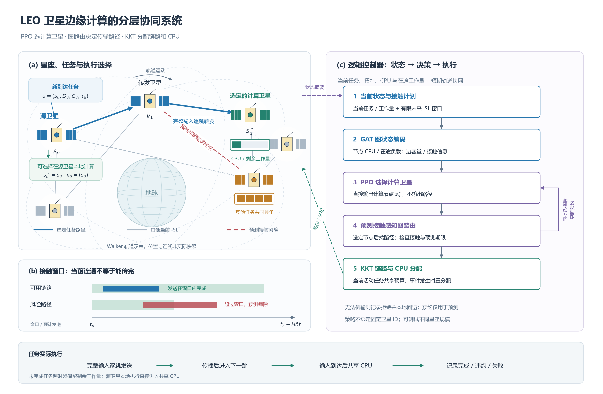

# 提出方法：图强化学习卸载、接触感知路由与闭式资源分配

本文针对 [系统模型](SYSTEM_MODEL_ZH.md) 中计算位置、动态传输与资源竞争的耦合，提出三层协同方法：GAT-PPO 选择计算卫星，预测接触感知图算法确定到该卫星的路径，KKT 闭式规则分配当前活动任务的链路与 CPU 资源。节点选择学习跨时隙决策后果，路由和资源模块处理已知网络条件与容量约束。本节为与当前实现对齐的方法初稿，实验结果补齐后再完善贡献分析。

## A. 分层求解框架

在时隙 $n$，控制器观察 $\mathcal O_n$，为任务 $u$ 请求计算节点 $\widetilde s_u$。随后按以下接口执行：

$$
\widetilde s_u\sim\pi_\theta(\cdot\mid\mathcal O_n,u,\mathcal B_n^{<u}),
$$

$$
(s_u^*,\mathcal P_u,b_u)
=\mathcal R(\mathcal O_n,u,\widetilde s_u,\mathcal B_n^{<u}),
\qquad
(r(t),f(t))=\Psi(\mathcal A(t),G[n(t)]).
$$

$\mathcal B_n^{<u}$ 为同批此前任务形成的预测承诺。$s_u^*$ 是系统模型中的实际执行节点；$\widetilde s_u$ 和 $b_u$ 是方法层新增的请求节点与拒绝标记。远程请求被拒绝时令 $b_u=1$ 并回退源卫星，否则 $b_u=0$：

$$
s_u^*=
\begin{cases}
\widetilde s_u,&b_u=0,\\
s_u,&b_u=1.
\end{cases}
$$

分别记录请求节点、实际节点及拒绝原因，拒绝不计作真实断链。图算法只在节点选定后搜索到该节点的路径，强化学习动作不包含路径或连续资源变量。

~~~text
当前拓扑、任务批次、资源状态与有限轨道前视
                      ↓
          GAT 编码节点和链路状态
                      ↓
          PPO 请求一个计算卫星
                      ↓
    针对该节点搜索接触感知传输路径
                      ↓
   预测期限检查；远程方案拒绝时本地回退
                      ↓
   更新预测承诺，继续决策同批下一任务
                      ↓
           完整批次提交执行器
                      ↓
    事件驱动 KKT 共享服务与成本反馈
~~~

方法限制下的策略族为 $(\pi_\theta,\mathcal R,\Psi)$。系统模型 P1 只描述物理服务成本 $C_n^{\rm sys}$。为了让节点策略承担不可执行请求的代价，方法层增加拒绝项：

$$
B_n=\sum_{u\in\mathcal U[n]}b_u,\qquad
C_n^{\rm alg}=C_n^{\rm sys}+\alpha_fB_n.
$$

对应当前实现的训练问题为

$$
\text{(P2)}:\quad
\min_\theta
\mathbb E_{(\pi_\theta,\mathcal R,\Psi)}
\left[\sum_n\gamma^nC_n^{\rm alg}\right].
$$

$\gamma$ 是方法层折扣系数。P2 使用固定路由、资源分配和拒绝惩罚，是求解 P1 的受限代理目标，不是 P1 的等价变换或全局求解；实验应同时报告物理结果和含拒绝项的实现成本。期限筛选和预约不保证真实成功。

## B. 图状态编码与卫星节点选择

### 1. 可观测状态

节点输入包括计算驻留工作量、在途工作量、异构计算容量、归一化 ECI 坐标，以及该源节点的新批次计算量和任务数。链路输入包括距离、容量、发送积压和预测范围内的可用比例。全局上下文包括剩余到达时域、活动阶段数量、总工作量及期限摘要。

任务输入包括 $D_u,C_u,\tau_u$、相对计算尺度及批次位置。针对每颗卫星 $s$，补充特征 $\mathbf z_{u,s}$ 包括

$$
\frac{Q_s}{F_s},\quad \frac{I_s}{F_s},\quad
\frac{V_s^{\rm prefix}}{F_s},\quad \frac{W_u}{F_s},
\quad \|\overline{\mathbf q}_s-\overline{\mathbf q}_{s_u}\|,
\quad \operatorname{hop}(s_u,s),\quad
\mathbf1\{s\text{ 在结构筛选范围内可达}\}.
$$

$V_s^{\rm prefix}$ 是同批此前任务承诺给实际执行卫星 $s$ 的计算量。特征按训练配置尺度归一化，并对工作量等长尾数值使用符号对数变换。当前维度为节点 8、链路 4、全局上下文 12、任务 5、节点补充状态 7；完整映射见 [RL.md](RL.md)。

### 2. 边特征图注意力

基于 [Graph Attention Networks](https://arxiv.org/abs/1710.10903) 的邻域注意力思想，实现加入边特征、自环、残差和层归一化。对一个注意力头，

$$
e_{s\leftarrow j}^{(l)}
=\operatorname{LeakyReLU}\left(
\mathbf a_{\rm dst}^{T}\mathbf W^{(l)}\mathbf h_s^{(l)}
+\mathbf a_{\rm src}^{T}\mathbf W^{(l)}\mathbf h_j^{(l)}
+\mathbf a_{\rm edge}^{T}\mathbf x_{j,s}^{E}
\right),
$$

$$
\alpha_{s\leftarrow j}^{(l)}
=
\frac{\exp(e_{s\leftarrow j}^{(l)})}
{\sum_{k\in\mathcal N(s)\cup\{s\}}\exp(e_{s\leftarrow k}^{(l)})}.
$$

各头聚合邻居变换后的表示，经拼接、输出映射与 ELU 后进行残差更新和层归一化。自环确保孤立节点仍能产生表示。图上下文为

$$
\mathbf h_G
=\phi_G\left(
\operatorname{mean}_s\mathbf h_s,\,
\operatorname{max}_s\mathbf h_s,\,
\mathbf x_n^{\rm ctx}
\right).
$$

网络只使用当前图上的消息传递；未来信息以规定的链路状态摘要进入编码，并由后置路由读取有限接触计划，不读取未来任务到达。

### 3. 共享评分与基本筛选

共享评分器对每颗卫星计算

$$
\ell_{u,s}
=g_\theta\left(
\mathbf h_s,\mathbf h_{s_u},\mathbf h_G,
\phi_T(\mathbf x_u),\phi_D(\mathbf z_{u,s})
\right).
$$

基本筛选先限制当前图最短跳数不超过 $H_c$；可选 CPU 下界筛选进一步要求

$$
\frac{W_u}{F_s}\le\tau_u.
$$

这是该节点独占计算的乐观下界，忽略传输与竞争，因此只用于排除明显无法按期完成的节点。若所有节点均被屏蔽，恢复源节点作为可执行回退选择。令最终标记为 $m_{u,s}$，策略为

$$
\pi_\theta(\widetilde s_u=s\mid\mathcal O_n,u,\mathcal B_n^{<u})
=
\frac{m_{u,s}\exp(\ell_{u,s})}
{\sum_jm_{u,j}\exp(\ell_{u,j})}.
$$

训练时采样，验证和评估时取最大概率节点。卫星 ID 仅用于索引，不作为可学习数值特征。输出通过共享评分随节点数变化，无需绑定固定规模的末层。该结构支持跨规模运行；其性能泛化仍需冻结权重和训练尺度的实验检验。当前策略不使用预先搜索的路径、路径排名或手工完成时间 logit 先验。

## C. 节点选择后的接触感知图路由

### 1. 逐跳预测与接触检查

对于已选节点 $\widetilde s_u$，在当前图中搜索从 $s_u$ 到该节点、跳数不超过 $H_p$ 的无环路径。对预计开始于 $\widehat a_{u,e}$ 的一跳，设参考速率比例为 $\eta_R\in(0,1]$，预测预约集合为 $\mathcal B_e$，预计发送结束时刻为

$$
\widehat b_{u,e}
=\inf\left\{
t\ge\widehat a_{u,e}:
\int_{\widehat a_{u,e}}^t
\eta_R R_e(\xi)\mathbf1\{\xi\notin\mathcal B_e\}\,d\xi
\ge D_u
\right\}.
$$

在该发送区间内链路必须连续可用。预计下一跳开始于发送结束加传播时延，传播距离取预计该跳开始时的快照。允许在连续接触中因已知预约延后发送，但不跨已知断链等待下一次接触。

开启未来信息时，默认要求每跳发送区间均被有限接触预测覆盖。预测边界之外的区间不当作已验证接触；允许未知区间的配置应单独报告。CPU 预测可超过接触前视末端，因为容量假设固定，但它仍不知道未来业务竞争。关闭未来信息时使用当前快照外推参考服务，不能将这种外推表述为已知未来连接。

### 2. 路由代价与有界搜索

对预测可执行的路径，定义

$$
J_{\rm route}(\mathcal P_u)
=\widehat T_u^{\rm net}(\mathcal P_u)
+\lambda_r\sum_{e\in\mathcal P_u}
\frac{1}{1+m_{u,e}/t_{\rm ref}}
+\lambda_l\sum_{e\in\mathcal P_u}
\frac{B_e^{\rm tx}[n]}{D_u}.
$$

$m_{u,e}$ 为预计发送完成后剩余的已覆盖接触长度，$t_{\rm ref}=1$ s。$\lambda_r,\lambda_l$ 单位为 s，将无量纲风险与拥塞偏好转换为路由评分。两项不额外计入实际完成时延；关闭未来信息时关闭风险项。

实现采用时间相关路径标签搜索。标签保存路径前缀、预计到达时间及代价；使用到目标的当前最短跳数下界剪枝，并禁止重复节点。达到完整路径时更新已找到的最佳方案，直到扩展预算耗尽或搜索结束。记录搜索截断标记，返回预算内找到的最佳完整路径，不声称精确 CGR 或所有情形的全局最优。

路由首先按网络代价选择路径，再执行预测完成时间检查；当前并不因最低网络代价路径超期而保证继续寻找另一条满足期限的路径。若无可验证路径或该远程方案预测超期，则记录 $b_u=1$ 并本地回退。源节点直接执行，不因其预测超期而丢弃任务。

## D. 预测预约与同批次竞争处理

同批任务按相对期限和 task ID 排序。在边界构建预测日历，纳入当前 CPU 驻留工作量和发送/传播阶段的既有任务承诺。对已在传播的任务，从剩余传播结束后的节点继续预测；对正在发送的任务，当前跳使用剩余输入量，后续跳使用完整输入量。

预测 CPU 日历先以当前 $Q_s/F_s$ 表示已有工作承诺。对于输入预计在 $\widehat a_u^{\rm cpu}$ 到达的任务，寻找不与已有预约重叠的最早 CPU 区间：

$$
\widehat c_u
=\operatorname{FirstFree}\left(
\mathcal B_{s_u^*}^{\rm cpu},
\widehat a_u^{\rm cpu},
\frac{W_u}{F_{s_u^*}}
\right),\qquad
\widehat t_u^{\rm done}=\widehat c_u+\frac{W_u}{F_{s_u^*}}.
$$

FirstFree 在此返回区间起点；预测节点处理代价为

$$
\widehat\omega_{u,s_u^*}^{\rm cpu}(\widehat a_u^{\rm cpu})
=\widehat t_u^{\rm done}-\widehat a_u^{\rm cpu}.
$$

CPU 预约不能早于输入预计到达。完成一次节点选择与路由处理后，日历按实际执行节点更新，包括拒绝后的本地执行；后续任务读取新增承诺。真实时间在全部任务决策完成后才前进。

该日历使用独占参考服务近似竞争，真实执行使用处理器共享。预测预约不锁定真实链路或 CPU，也不包含尚未到达的任务，所以预约可行不代表真实截止期保证。预测串行承诺与真实处理器共享需要在文中明确区分。

## E. KKT 闭式链路与 CPU 分配

固定当前活动集合，采用静态资源代理问题

$$
\min_{x_u>0}\sum_u\frac{w_u}{x_u},
\qquad \text{s.t.}\ \sum_ux_u\le C.
$$

对正权重，其拉格朗日函数为

$$
\mathcal L=\sum_u\frac{w_u}{x_u}
+\zeta\left(\sum_ux_u-C\right).
$$

由驻点条件和容量约束取等号可得

$$
-\frac{w_u}{x_u^2}+\zeta=0,\qquad
x_u^*=C\frac{\sqrt{w_u}}{\sum_v\sqrt{w_v}}.
$$

链路取 $w_u=D_u,C=R_e(t)$；CPU 取 $w_u=W_u,C=F_s$：

$$
r_{u,e}(t)
=R_e(t)\frac{\sqrt{D_u}}
{\sum_{v\in\mathcal T_e(t)}\sqrt{D_v}},
\qquad
f_{s,u}(t)
=F_s\frac{\sqrt{W_u}}
{\sum_{v\in\mathcal K_s(t)}\sqrt{W_v}}.
$$

权重使用任务原始工作量，剩余工作量只用于确定完成事件。发送、传播或计算完成以及到达和拓扑变化引起活动集合变化时重新分配；空集合不分配资源。ISL 两个方向使用同一分母和同一容量预算。

该规则是固定活动集合、原始工作量静态代理目标的最优解，不是基于剩余工作量的动态全局完成时延最优解。用于比较的等分分配保持相同容量和任务，只改变资源共享规则。

## F. 批次 PPO 训练

以一个物理时隙作为强化学习 transition。奖励以系统物理成本加方法层拒绝惩罚构造：

$$
r_n^{\rm RL}=
-\frac{H_n+\alpha_dM_n+\alpha_f(J_n+B_n)}{Z}.
$$

策略采样之后的路由拒绝由该奖励反馈，PPO 保存的动作始终是请求节点，不把实际本地回退重新视为采样动作。

对按序处理的 $K_n$ 个任务，批次联合条件概率为

$$
p_\theta(\widetilde{\mathbf s}_n\mid\mathcal O_n)
=\prod_{k=1}^{K_n}
\pi_\theta(\widetilde s_{u_k}\mid
\mathcal O_n,u_k,\mathcal B_n^{<u_k}).
$$

训练保存每次采样时的特征、mask 和请求节点。在重算似然时使用这些冻结条件，计算一个物理时隙的联合概率比

$$
\rho_n(\theta)=
\exp\left(
\sum_k\log\pi_\theta(\widetilde s_{u_k}\mid\cdot)
-\sum_k\log\pi_{\theta_{\rm old}}(\widetilde s_{u_k}\mid\cdot)
\right).
$$

采用 [Proximal Policy Optimization Algorithms](https://arxiv.org/abs/1707.06347) 的剪裁代理目标：

$$
L_{\rm clip}(\theta)=
\mathbb E_n\left[
\min\left(
\rho_n(\theta)\widehat A_n,\,
\operatorname{clip}(\rho_n(\theta),1-\epsilon,1+\epsilon)
\widehat A_n
\right)
\right].
$$

状态价值由图上下文估计 $V_\phi(\mathcal O_n)$。广义优势估计使用

$$
\delta_n=r_n^{\rm RL}
+\gamma(1-d_n)V_\phi(\mathcal O_{n+1})
-V_\phi(\mathcal O_n),
$$

$$
\widehat A_n=\delta_n
+\gamma\lambda_{\rm GAE}(1-d_n)\widehat A_{n+1},
$$

其中 $d_n$ 为终止标记。训练损失包括负剪裁目标、价值回归和按任务数归一化的条件分布熵奖励。无可选择动作的时隙不提供 actor 更新，但仍可提供价值学习。使用梯度裁剪和联合 KL 阈值提前停止过大的策略更新。价值尺度只用于数值训练，奖励与 GAE 保留系统成本对应的量纲。

长期成本使策略能够考虑当前卸载对后续工作量和资源竞争的影响；这说明其优化目标，不构成“已经学会长期规划”或“必然优于贪心”的性能结论。

## G. 在线执行流程

~~~text
输入：当前观测、有限接触计划、策略权重、资源预算
1. 编码当前图和全局上下文。
2. 使用现有活动任务初始化预测预约。
3. 将到达任务按 deadline、task ID 排序。
4. 对每个任务：
   a. 构建任务及节点补充状态，执行节点基本筛选。
   b. PPO 采样或确定性选择请求计算卫星。
   c. 图算法仅搜索到该卫星的路径。
   d. 检查预计接触与完成时间；拒绝远程请求时本地回退。
   e. 保存请求动作及条件概率，更新实际执行节点的预测承诺。
5. 将完整任务批次与实际执行指令一次性提交。
6. 按真实事件重分配链路和 CPU，推进一个物理时隙。
7. 保存成本、任务状态和 transition；到达结束后继续排空。
训练阶段：收集 rollout，计算 GAE，更新 PPO，定期验证与保存。更新时将冻结的图与变长任务打包为 minibatch，仍按物理时隙归并联合概率与熵；在线节点采样与预约保持原顺序。相同 observation 内复用跳数与积压，路由用非负前缀代价下界剪去不能改善当前最佳解的标签，保留原评分和同代价平局规则。该实现优化不改变 P2 目标或 KKT 分配。
~~~

## H. 实验验证与实现边界

| 对照 / 消融 | 保持一致与改变的内容 |
|---|---|
| MLP-PPO | 相同节点动作、图路由及资源分配，只替换图编码器 |
| node_greedy | 相同接触路由、预约和资源分配，以当前预测完成时间选节点 |
| snapshot_route | 按当前容量计算路径代价，关闭未来特征；保留预测期限检查 |
| no_future | 接触路由保持不变，关闭未来信息，令 $H=0$ |
| no_booking | 不加入同批此前任务承诺，仍保留现有活动任务 |
| no_node_mask | 关闭独占 CPU 期限下界；保留结构限制和后置期限检查 |
| equal | 相同任务、拓扑和预算，真实链路 / CPU 等分服务 |
| 48→24/72/96 | 冻结权重及训练尺度，检验跨规模运行与性能变化 |

学习消融各自训练并验证选模；不将完整方法权重直接切开关作为正式训练消融。node_greedy 检验长期节点学习是否提供超出共享路由和预约的收益。实验同时报告成本、成功率、均值/P95、实际断链、拒绝与截尾，具体协议见 [EXPERIMENTS.md](EXPERIMENTS.md)。

当前 GAT 使用稠密注意力张量，不声称计算或存储复杂度对卫星数量线性增长。图路由的扩展预算、跳数上限及截断比例应一并报告。特征 schema=3，旧联合节点—路径检查点不兼容；历史数据不能套用新版模型解释。

本研究可验证的贡献包括分层通信计算协同、有限接触先验辅助传输，以及共享图评分的跨规模节点选择。GAT、PPO 和 KKT 本身来自已有方法，贡献需要通过一致对照和机制消融支持。代码入口与训练参数见 [RL.md](RL.md)，运行命令见 [SERVER_EXPERIMENTS.md](SERVER_EXPERIMENTS.md)。
