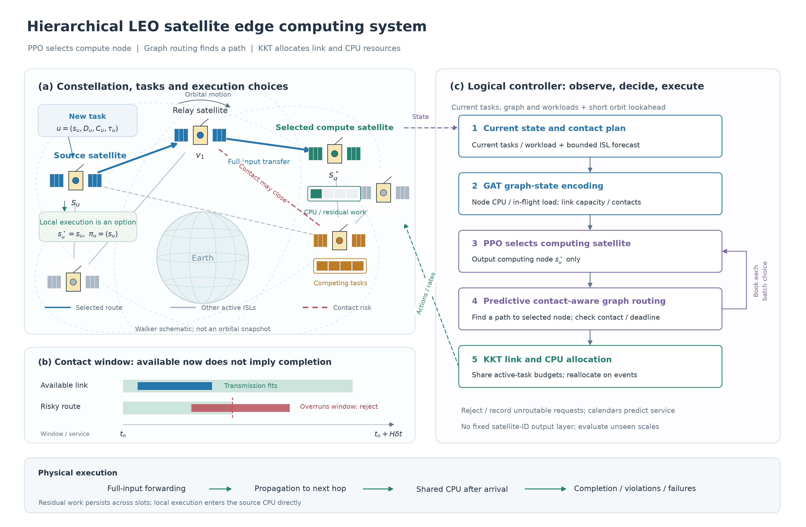

# System Model

We consider a multi-LEO satellite edge computing system comprising satellites $\mathcal S=\{0,\ldots,S-1\}$. Satellite $s$ carries an onboard server with effective capacity $F_s$ CPU cycles/s and exchanges task inputs through inter-satellite links (ISLs). Tasks may execute at their source or be offloaded to another satellite. The proposed architecture separates three decisions: graph reinforcement learning selects the computing satellite, predictive contact-aware graph routing determines a path to that selected satellite, and closed-form resource optimization allocates realized communication and computation service.

The admission horizon contains $N$ slots of duration $\delta t$, with boundary $t_n=n\delta t$. Decisions occur at boundaries, whereas transmission, propagation and computation evolve through continuous-time events. Residual work persists across slots. After admission, the system drains for at most $N_d$ slots without new tasks. A logical controller observes current tasks, topology and workloads and a bounded orbit forecast; future task arrivals are unavailable. Task inputs are already at their source satellites. Ground access, result return, signaling overhead and energy are outside this model.

## A. Orbital Motion and Dynamic ISL Topology

A circular two-body Walker-Delta constellation has $P$ planes and $J$ satellites per plane, with $S=PJ$. For plane $p$ and member $j$, define

$$
\Omega_p=\frac{2\pi p}{P},\quad \psi_{p,j}=\frac{2\pi j}{J}+\frac{2\pi F_Wp}{PJ},\quad
r=R_E+h,\quad \nu=\sqrt{\mu_E/r^3},\quad \vartheta_{p,j}[n]=\psi_{p,j}+\nu t_n.
$$

Here $F_W,h,R_E,\mu_E$ denote the phase factor, altitude, Earth radius and gravitational parameter. Given inclination $i$, the Earth-centered inertial position is

$$
\mathbf q_{p,j}[n]=r\begin{bmatrix}
\cos\Omega_p\cos\vartheta_{p,j}[n]-\sin\Omega_p\sin\vartheta_{p,j}[n]\cos i\\
\sin\Omega_p\cos\vartheta_{p,j}[n]+\cos\Omega_p\sin\vartheta_{p,j}[n]\cos i\\
\sin\vartheta_{p,j}[n]\sin i
\end{bmatrix}.
$$

ISLs satisfy a maximum distance, Earth clearance, degree budget and cross-plane latitude limit. With $d_{ij}[n]=\|\mathbf q_i[n]-\mathbf q_j[n]\|$, line of sight requires

$$
\min_{\zeta\in[0,1]}\|\mathbf q_i[n]+\zeta(\mathbf q_j[n]-\mathbf q_i[n])\|>R_E+h_{\rm clr}.
$$

Eligible neighboring satellites within each plane are connected first. Eligible adjacent-plane links are then added in increasing distance order, respecting maximum degree $d_{\max}$. This produces $G[n]=(\mathcal S,\mathcal E[n])$ without fabricating connectivity. This exogenous link rule is independent of the learned offloading policy. Although topology can be cached offline, the policy receives only its specified forecast window.

An active undirected link $e=\{i,j\}$ has task-class capacity $R_e[n]$ and propagation delay $d_{ij}[n]/c_0$. Default active-link capacity is constant; distance affects eligibility and propagation rather than an additional fading model. This is an idealized orbital and service-budget model, not TLE/SGP4 propagation or a measured hardware simulator.

## B. Tasks and Whole-Task Offloading

Let $\mathcal U[n]$ denote the arriving batch. Task $u$ is represented by

$$
u=(s_u,D_u,C_u,\tau_u,t_u),\qquad W_u=D_uC_u,\qquad t_u=t_n,
$$

where $s_u,D_u,C_u,\tau_u$ denote source, input bits, cycles/bit and relative deadline. Batch size is Poisson; input size, complexity and deadline are independently uniform in their configured ranges. For hotspot set $\mathcal H$ and mixture weight $p_h$,

$$
\Pr(s_u=s)=\frac{1-p_h}{S}+\frac{p_h}{|\mathcal H|}\mathbf1\{s\in\mathcal H\}.
$$

Thus actual hotspot share includes the uniform component. Heterogeneous CPU capacities are sampled once per replay seed and remain fixed throughout that replay.

Binary association $a_{u,s}$ indicates the actual execution satellite:

$$
a_{u,s}\in\{0,1\},\qquad\sum_{s\in\mathcal S}a_{u,s}=1.
$$

Tasks are indivisible. PPO samples only a requested computing satellite $\widetilde s_u\in\mathcal S$; its action does not contain a path or a preconstructed node--path combination. An independent graph router runs after node selection. Local execution uses path $(s_u)$.

## C. Contact Windows and Routing to the Selected Satellite

At boundary $t_n$, the controller receives the current and next $H$ snapshots, covering until $t_n+(H+1)\delta t$. The nominal lookahead is $H\delta t$; $H=0$ uses only the current snapshot. Consecutive available intervals form the contact plan

$$
\mathcal C_e[n]=\{[b_{e,k},d_{e,k})\}_k,\qquad K_{e,k}=\int_{b_{e,k}}^{d_{e,k}}R_e(t)\,dt.
$$

A window ending at the forecast boundary does not certify an actual contact closure. Remote transmissions beyond covered intervals are excluded by default. Unverified extrapolation, when enabled, is reported explicitly. Future traffic is never inspected.

After PPO selects $\widetilde s_u$, the router searches loop-free current-graph paths to that node only:

$$
\pi_u=(v_0=s_u,v_1,\ldots,v_{h_u}=\widetilde s_u),\qquad h_u\le H_p.
$$

Using actual task input size and reference rate $\eta_RR_e(t)$, the router checks predicted sending intervals against future link availability. For reference calendar bookings $\mathcal B_e$, one hop must satisfy

$$
\int_{\widehat b_{u,e}}^{\widehat d_{u,e}}\eta_RR_e(t)\mathbf1\{t\notin\mathcal B_e\}\,dt\ge D_u,
$$

with uninterrupted contact during the sending interval. Propagation follows transmission; the next hop begins only after full arrival. Propagation does not require continued contact. Reference bookings may postpone sending, but the implementation does not wait across known contact gaps or reroute during execution.

The route score is

$$
J_{\rm route}(\pi_u)=\widehat T_u^{\rm net}(\pi_u)+
\lambda_r\sum_{e\in\pi_u}\frac{1}{1+m_{u,e}/t_{\rm ref}}+
\lambda_l\sum_{e\in\pi_u}\frac{B_e^{\rm tx}[n]}{D_u}.
$$

Here $m_{u,e}$ is the remaining covered contact interval after predicted sending, $t_{\rm ref}=1$ s, and $B_e^{\rm tx}[n]$ is current transmitting backlog. Coefficients $\lambda_r,\lambda_l$ have units of seconds. These preference penalties are not additional realized physical delays. The risk term is disabled without future snapshots.

A bounded time-dependent path-label search returns the best complete route visited within the expansion budget. It is not claimed to be globally optimal or an exact CGR solver; budget exhaustion is recorded. Prediction calendars are seeded from active tasks and previously processed tasks in the same batch. Predicted CPU bookings start after data arrival. Calendars do not reserve actual fluid-shared resources.

Before selection, a basic node mask enforces current reachability within $H_c$ shortest-path hops and optionally the optimistic necessary condition $W_u/F_s\le\tau_u$. This ignores transport and competition and provides no safety certificate. If all nodes are excluded, the source is restored and flagged. After routing, contact coverage and calendar-based completion are checked. If routing fails or predicted completion exceeds the deadline, execution falls back to the source, with requested node and rejection reason retained. Local execution may still miss its deadline.

## D. Store-and-Forward and Shared Computation

Each hop sends the complete $D_u$-bit input. For tasks currently sending on link $e$, denoted $\mathcal T_e(t)$,

$$
\sum_{u\in\mathcal T_e(t)}r_{u,e}(t)\le R_e(t),\qquad r_{u,e}(t)\ge0.
$$

Both directions share one undirected ISL budget. Only the current hop consumes realized capacity. A contact loss while transmitting terminates the task as a physical route failure; planning rejection is a separate event.

For tasks whose inputs have arrived and which are computing at satellite $s$, denoted $\mathcal K_s(t)$,

$$
\sum_{u\in\mathcal K_s(t)}f_{s,u}(t)\le F_s,\qquad f_{s,u}(t)\ge0.
$$

Processor sharing gives each active task continuous service, with $\dot w_u(t)=-f_{s,u}(t)$ and $\dot d_u(t)=-r_{u,e}(t)$. CPU service begins only after complete input arrival.

Define $Q_s(t)=\sum_{u\in\mathcal K_s(t)}w_u(t)$ and in-transit committed cycles $I_s(t)$. Ratios $Q_s/F_s$ and $I_s/F_s$ are workload features and prediction inputs. An additional $Q_s/F_s$ FIFO wait must not be added to the event-based completion time.

## E. KKT Resource Allocation

For a fixed active set, the static surrogate

$$
\min_{x_u>0}\sum_u\frac{w_u}{x_u},\qquad \sum_ux_u\le C
$$

has KKT condition $-w_u/x_u^2+\zeta=0$, yielding

$$
x_u^*=C\frac{\sqrt{w_u}}{\sum_v\sqrt{w_v}}.
$$

For links, use $w_u=D_u,C=R_e(t)$; for CPU, use $w_u=W_u,C=F_s$:

$$
r_{u,e}(t)=R_e(t)\frac{\sqrt{D_u}}{\sum_{v\in\mathcal T_e(t)}\sqrt{D_v}},\qquad
f_{s,u}(t)=F_s\frac{\sqrt{W_u}}{\sum_{v\in\mathcal K_s(t)}\sqrt{W_v}}.
$$

Implementation weights use original task workload. Residual workload determines completion events. Allocation is recomputed on arrivals, transmission/propagation/computation completion and topology changes. Optimality applies to this fixed-set surrogate, not the globally coupled dynamic completion problem. Equal sharing under identical budgets is the resource ablation.

## F. Delay, Outcomes and Objective

For a completed task,

$$
T_u=t_u^{\rm done}-t_u=\sum_{e\in\pi_u}T_{u,e}^{\rm tx}+\sum_{e\in\pi_u}T_{u,e}^{\rm prop}+T_u^{\rm cpu}.
$$

Stage durations come from realized service; local network terms are zero. Success requires completion by $\tau_u$. By default, a deadline miss is counted once and service continues. Tasks unfinished at drain termination are censored without assigning a fabricated completion delay.

For active-task count $A(t)$, holding cost is

$$
H_n=\int_{t_n}^{t_{n+1}}A(t)\,dt.
$$

Let $M_n,J_n,B_n$ denote newly recorded deadline misses, actual contact-loss failures, and rejected requested remote destinations followed by local fallback. Reuse the route penalty for planning rejection to prevent cost-free invalid requests:

$$
C_n=H_n+\alpha_dM_n+\alpha_f(J_n+B_n),\qquad r_n=-C_n/Z.
$$

Penalty coefficients have units of seconds; $Z$ is fixed. Planning rejection and physical route failure remain separate metrics. Basic local-mask fallback does not itself count as a physical route failure. Holding cost accumulates active time until completion, failure, dropping or censoring, and is not mean delay conditioned on completion. Every policy uses the same objective definition.

Under deterministic routing map $\mathcal R$ and allocation map $\Psi$, the layered problem is

$$
\text{(P1)}:\quad\min_\theta\mathbb E_{\pi_\theta}\!\left[\sum_{n=0}^{N+N_d-1}\gamma^nC_n\right],
$$

$$
\widetilde s_u\sim\pi_\theta(\cdot\mid\mathcal O_n,u,\text{batch prefix}),\quad
(s_u^*,\pi_u)=\mathcal R(\mathcal O_n,u,\widetilde s_u),\quad
(r(t),f(t))=\Psi(\text{active tasks and resource budgets}),
$$

subject to unique execution destination, simple paths, hop bounds and link/CPU budgets. Deadlines are handled by prediction and penalties rather than guaranteed hard constraints. PPO optimizes long-horizon computing placement, the graph router handles transport to the selected node, and KKT handles instantaneous resource allocation. Approximate prediction and finite training do not imply superiority over every heuristic.

## G. Graph Policy and Batch Decisions

Node features include residual CPU workload, heterogeneous capacity, in-transit cycles, normalized ECI position and source-local batch workload/count. Edge features include distance, capacity, transmitting backlog and forecast availability. Task features include size, complexity, deadline, computing scale and batch position.

GAT produces node representations $\mathbf h_s$ and pooled graph representation $\mathbf h_G$. A shared scorer evaluates every satellite:

$$
\ell_{u,s}=g_\theta(\mathbf h_s,\mathbf h_{s_u},\mathbf h_G,\mathbf h_u,\mathbf z_{u,s}),\qquad
\pi_\theta(\widetilde s_u=s\mid\mathcal O_n,u)=\frac{\exp(\ell_{u,s})m_{u,s}}{\sum_j\exp(\ell_{u,j})m_{u,j}}.
$$

Here $\mathbf z_{u,s}$ includes CPU/in-transit/prefix workload indicators, exclusive computation time, source-relative distance and shortest current hop count. The policy has no precomputed paths, path ranking or handcrafted completion-time logit prior. IDs index data rather than learned numeric inputs, and output length follows constellation size.

Tasks are processed in deadline/ID order. Each node choice is followed by routing and predictive booking at its actual execution node. Physical time advances only after the complete batch is submitted. PPO stores the requested node's conditional log probability and immutable features/mask; the joint batch ratio corresponds to one physical slot. Router fallback is not a second policy sample.

MLP-PPO preserves the same scorer, router and allocation while replacing the graph encoder. Cross-scale evaluation freezes weights and training normalization. Supporting variable output size is a structural property; zero-shot performance requires measured evidence.

## H. Configuration and Implementation Alignment

| Setting | compute24 | contact66 |
|---|---|---|
| Walker constellation | 3×8, 24 satellites | 6×11, 66 satellites |
| Altitude / inclination | 600 km / 53° | 780 km / 80° |
| ISL task-class budget | 200 Mbit/s | 100 Mbit/s |
| CPU capacity | 40–100 Gcycles/s | 40–100 Gcycles/s |
| Input / complexity | 20–60 Mbit / 1000–2000 cycles/bit | 20–60 Mbit / 500–1500 cycles/bit |
| Arrivals | 4/slot = 16/s | 11/slot = 44/s |
| Hotspots / mixture | 3 / 0.2 | 8 / 0.2 |
| Deadline | 2–8 s | 2–8 s |
| Slot / admission / maximum drain | 0.25 s / 600 s / 300 s | Same |
| Lookahead / reference fraction | H=16 / 0.5 | Same |

These are two physical scenarios using the same method. Parameters are engineering assumptions rather than measured calibration. Actual hotspot fractions are approximately 0.30 and 0.297. At a representative 70 Gcycles/s, compute24 hotspot load is $16\times0.1\times60/70\approx1.37$ per satellite. Exact seeded heterogeneity and load diagnostics are saved in `calibration.json`.

| Component | Implementation |
|---|---|
| Orbits and exogenous ISLs | `topology/walker.py`, `topology/graph_builder.py` |
| Node-only learned action | `models/destination_scorer.py`, `agents/ppo_agent.py` |
| Forecast and selected-node route | `network/contact_plan.py`, `routing/contact_aware_router.py` |
| Predictive bookings | `routing/reservations.py` |
| Realized execution and rejection records | `env/event_engine.py`, `routing/action_builder.py` |
| KKT sharing | `resource/cpu_allocator.py`, `resource/link_allocator.py` |
| Cost and outcomes | `env/reward.py`, `env/metrics.py` |

Training replay seed is fixed at 2026; validation and development comparison use seed 100. Validation reuse is explicitly labeled and is not independent testing. One seed provides no confidence interval. Report completed-task mean/P95 jointly with success, actual route failure, routing rejection and censoring. The `node_greedy` control uses the same predictive router, booking and resources to isolate the contribution of long-horizon learned node placement. Performance conclusions require completed training and consistent comparisons.
