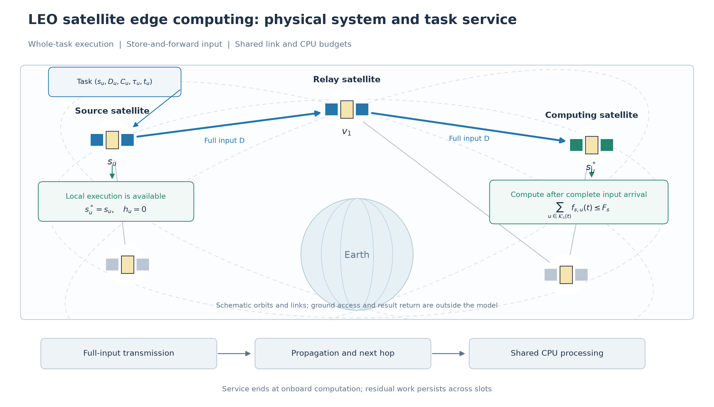
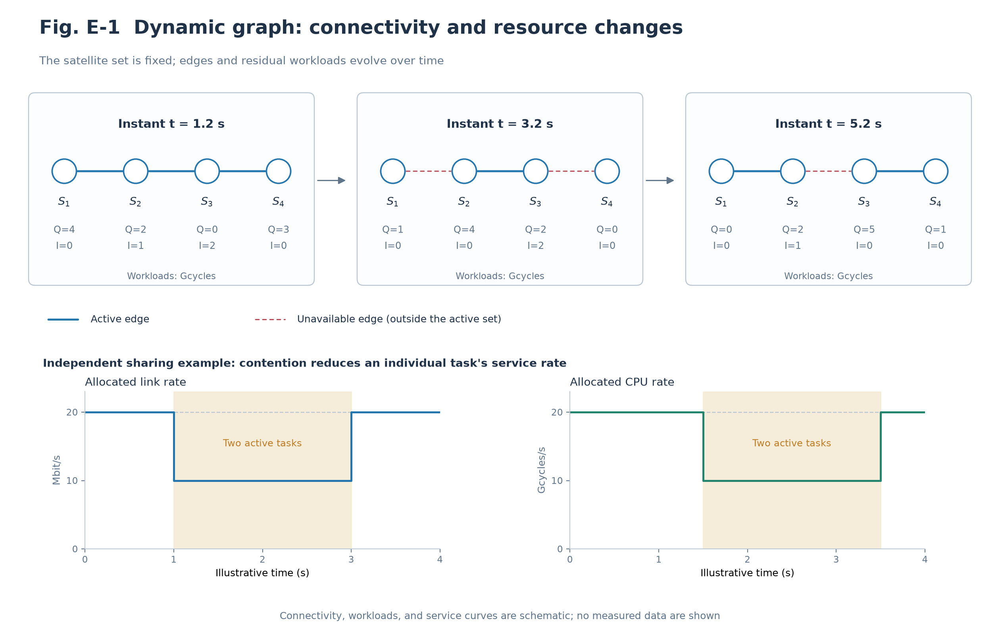
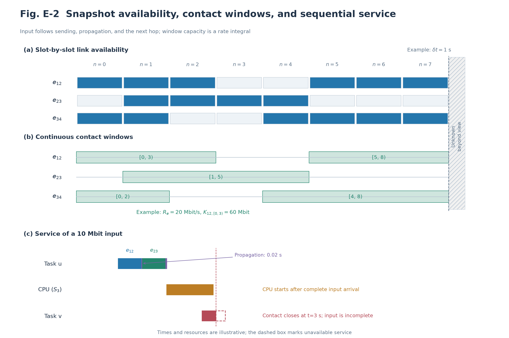

# System Model

We consider an onboard edge computing system comprising low Earth orbit (LEO) satellites $\mathcal S=\{0,\ldots,S-1\}$. Each satellite carries an onboard server and exchanges task inputs through inter-satellite links (ISLs). Task inputs are already available at their source satellites, as in processing satellite-collected data or tasks whose ground upload has finished. Spatially uneven arrivals and heterogeneous computing capacities can overload individual sources while other satellites retain spare capacity, motivating coordinated execution placement, routing, and resource allocation.

A task executes at its source or transfers its entire input to another satellite. Service completion is defined as the end of onboard computation; ground access and result return are outside the measured service chain. Tasks are indivisible, with no execution-time rerouting or computation migration. Storage capacity, energy consumption, and control signaling overhead are not modeled.

The admission horizon contains $N$ slots of duration $\delta t$, with boundaries $t_n=n\delta t$. Arrivals and offloading decisions occur at boundaries, while transmission, propagation, and computation evolve through continuous-time events within slots. Admission is followed by draining until all tasks terminate or at most $N_d$ additional slots elapse. A logical controller observes current topology, tasks, and resource states together with a bounded orbital forecast, but cannot access future task arrivals. The following subsections define the network, tasks, resources and delay, contact windows, and joint optimization problem.

## A. Satellite Network and Orbital Motion

We adopt a circular two-body Walker-Delta constellation with $P$ orbital planes and $J$ satellites per plane, so $S=PJ$. For plane $p$ and member $j$, define

$$
\Omega_p=\frac{2\pi p}{P},\qquad
\psi_{p,j}=\frac{2\pi j}{J}+\frac{2\pi F_Wp}{PJ},
\qquad r_{\rm orb}=R_E+h.
$$

Here $F_W,h,R_E$ denote the phase factor, orbital altitude, and Earth radius. With gravitational parameter $\mu_E$,

$$
\nu=\sqrt{\frac{\mu_E}{r_{\rm orb}^3}},\qquad
T_{\rm orb}=\frac{2\pi}{\nu},\qquad
\vartheta_{p,j}(t)=\psi_{p,j}+\nu(t+t_{\rm epoch}).
$$

Here $t_{\rm epoch}\ge0$ is the start offset of the observation horizon relative to the orbital reference epoch and is fixed within that horizon. Different offsets describe the same Walker constellation at different orbital times, preserving orbital planes, relative satellite phases, altitude and inclination. The original reference epoch has $t_{\rm epoch}=0$.

Given inclination $i$, the Earth-centered inertial position is

$$
\mathbf q_{p,j}(t)=r_{\rm orb}
\begin{bmatrix}
\cos\Omega_p\cos\vartheta_{p,j}(t)-\sin\Omega_p\sin\vartheta_{p,j}(t)\cos i\\
\sin\Omega_p\cos\vartheta_{p,j}(t)+\cos\Omega_p\sin\vartheta_{p,j}(t)\cos i\\
\sin\vartheta_{p,j}(t)\sin i
\end{bmatrix}.
$$

The implementation samples $\mathbf q_s[n]=\mathbf q_s(t_n)$ at slot boundaries and holds network snapshots piecewise constant. Orbital motion drives topology changes, whereas resource service evolves continuously within each snapshot. This is a snapshot-based topology with continuous-time service, rather than a snapshot-free model or TLE/SGP4 propagation.

ISLs can connect neighboring satellites within a plane or satellites in adjacent planes. With $d_{ij}[n]=\|\mathbf q_i[n]-\mathbf q_j[n]\|$, eligible links satisfy

$$
d_{ij}[n]\le d_{\rm ISL}^{\max},\qquad
\min_{\zeta\in[0,1]}
\|\mathbf q_i[n]+\zeta(\mathbf q_j[n]-\mathbf q_i[n])\|
>R_E+h_{\rm clr}.
$$

Cross-plane links additionally obey a configured latitude limit. Eligible intra-plane neighbor links are inserted first, followed by eligible cross-plane links in increasing distance order, subject to maximum degree $d_{\max}$. The resulting undirected graph is

$$
G[n]=(\mathcal S,\mathcal E[n]).
$$

Connectivity is not fabricated when physical rules produce disconnected graphs. Orbital and ISL construction rules are exogenous to offloading. An active link $e=\{i,j\}$ has task-class rate budget $R_e[n]$, set to the configured capacity by default. Distance affects eligibility and propagation, without an additional fading model.

## B. Task Arrivals and Whole-Task Offloading

Let $\mathcal U[n]$ be the arriving batch and $\lambda_{\rm arr}$ the mean arrival intensity in tasks/s:

$$
N_n^{\rm arr}=|\mathcal U[n]|
\sim\operatorname{Poisson}(\lambda_{\rm arr}\delta t).
$$

Batches are sampled independently across admission slots. Arrival instants are quantized to slot boundaries, rather than sampled continuously within slots. No tasks arrive during draining.

Task $u$ is described by

$$
\mathcal T_u=(s_u,D_u,C_u,\tau_u,t_u),\qquad
W_u=D_uC_u,\qquad t_u=t_n,\quad u\in\mathcal U[n].
$$

Here $s_u,D_u,C_u,\tau_u$ denote the source, input bits, cycles/bit, and relative deadline in seconds. Total workload is $W_u$ cycles and the absolute deadline is $t_u+\tau_u$. Independently,

$$
D_u\sim\mathcal U(D_{\min},D_{\max}),\qquad
C_u\sim\mathcal U(C_{\min},C_{\max}),\qquad
\tau_u\sim\mathcal U(\tau_{\min},\tau_{\max}).
$$

For hotspot set $\mathcal H$ and mixture probability $p_h$,

$$
\Pr(s_u=s)=\frac{1-p_h}{S}
+\frac{p_h}{|\mathcal H|}\mathbf1\{s\in\mathcal H\}.
$$

The actual hotspot fraction is $p_h+(1-p_h)|\mathcal H|/S$. Computing capacities are independently sampled once at system initialization,

$$
F_s\sim\mathcal U(F_{\min},F_{\max}),
$$

and remain fixed throughout that run. Effective CPU cycles/s are not directly interchangeable with GFLOPS. These distributions and task-class budgets are reproducible simulation assumptions, rather than measured workload or hardware calibration.

Each indivisible task executes at exactly one satellite:

$$
a_{u,s}\in\{0,1\},\qquad \sum_{s\in\mathcal S}a_{u,s}=1.
$$

Let $s_u^*$ denote the actual computing satellite. Its path is

$$
\mathcal P_u=(v_{u,0},\ldots,v_{u,h_u}),\qquad
v_{u,0}=s_u,\quad v_{u,h_u}=s_u^*.
$$

Local execution has $s_u^*=s_u$ and $h_u=0$. Remote paths are simple, use links present at submission, and satisfy hop bound $H_p$. Intermediate nodes forward input; all computation occurs at $s_u^*$.

## C. Dynamic Resource Sharing

Both directions of an undirected ISL share one capacity budget. For transmitting tasks $\mathcal T_e(t)$,

$$
\sum_{u\in\mathcal T_e(t)}r_{u,e}(t)\le R_e(t),\qquad
r_{u,e}(t)\ge0.
$$

Capacity satisfies $R_e(t)=R_e[n]$ for $t\in[t_n,t_{n+1})$ and is zero for unavailable links. Set $r_{u,e}(t)=0$ when $u\notin\mathcal T_e(t)$. A task consumes only its current transmitting hop. Future hops and propagation do not consume realized sending capacity.

For tasks $\mathcal K_s(t)$ whose complete inputs have arrived at computing satellite $s$,

$$
\sum_{u\in\mathcal K_s(t)}f_{s,u}(t)\le F_s,\qquad
f_{s,u}(t)\ge0.
$$

Set $f_{s,u}(t)=0$ when $u\notin\mathcal K_s(t)$. The execution mechanism uses processor sharing: active tasks receive service concurrently, with reallocation on changes in active sets or topology. This is not a serial FIFO queue.

Let $d_u^{\rm rem}(t)$ and $w_u^{\rm rem}(t)$ denote residual bits on the current hop and residual computing cycles. During the corresponding stages,

$$
\frac{d}{dt}d_u^{\rm rem}(t)=-r_{u,e}(t),\qquad
\frac{d}{dt}w_u^{\rm rem}(t)=-f_{s_u^*,u}(t).
$$

Bits reset to $D_u$ at the start of each hop, while cycles equal $W_u$ before computation begins. Residual work decreases by the integral of allocated service over each interval and persists across slot boundaries.

Define CPU-resident workload, in-transit committed workload, and link backlog as

$$
Q_s(t)=\sum_{u\in\mathcal K_s(t)}w_u^{\rm rem}(t),
$$

$$
I_s(t)=
\sum_{\substack{u:\,s_u^*=s\\u\text{ is transmitting or propagating}}}
w_u^{\rm rem}(t),\qquad
B_e^{\rm tx}(t)=\sum_{u\in\mathcal T_e(t)}d_u^{\rm rem}(t).
$$

$I_s$ excludes CPU-resident tasks. Ratios $Q_s/F_s$ and $I_s/F_s$ are workload time scales, not extra FIFO waiting terms to be added to measured completion delay.

## D. Store-and-Forward Service and Realized Delay

Each hop transmits the entire input $D_u$. Let $a_{u,\ell}^{\rm tx},b_{u,\ell}^{\rm tx}$ be the sending start and finish of hop $\ell$, with $e_{u,\ell}=\{v_{u,\ell-1},v_{u,\ell}\}$. For a successfully transmitted hop,

$$
b_{u,\ell}^{\rm tx}=
\inf\left\{
t\ge a_{u,\ell}^{\rm tx}:
\int_{a_{u,\ell}^{\rm tx}}^t r_{u,e_{u,\ell}}(\xi)\,d\xi
\ge D_u
\right\}.
$$

Propagation takes

$$
T_{u,\ell}^{\rm prop}
=\frac{d_{v_{u,\ell-1},v_{u,\ell}}[n_{u,\ell}^{\rm ref}]}{c_0}.
$$

$n_{u,\ell}^{\rm ref}$ is the snapshot of the final service interval before sending completes. A transmission finishing exactly at a boundary uses the preceding snapshot. This propagation duration is fixed once sending finishes.

The causal hop recursion is

$$
a_{u,1}^{\rm tx}=t_u,\qquad
a_{u,\ell+1}^{\rm tx}
=b_{u,\ell}^{\rm tx}+T_{u,\ell}^{\rm prop}.
$$

Complete input arrival at the computing satellite occurs at

$$
a_u^{\rm cpu}=
\begin{cases}
t_u,&h_u=0,\\
b_{u,h_u}^{\rm tx}+T_{u,h_u}^{\rm prop},&h_u>0.
\end{cases}
$$

Computation cannot begin before this arrival. For a completed task,

$$
t_u^{\rm done}
=\inf\left\{
t\ge a_u^{\rm cpu}:
\int_{a_u^{\rm cpu}}^t f_{s_u^*,u}(\xi)\,d\xi\ge W_u
\right\},
$$

$$
T_u=t_u^{\rm done}-t_u
=\sum_{\ell=1}^{h_u}
\left(b_{u,\ell}^{\rm tx}-a_{u,\ell}^{\rm tx}
+T_{u,\ell}^{\rm prop}\right)
+t_u^{\rm done}-a_u^{\rm cpu}.
$$

Competition changes these durations through time-varying allocated rates, without an additional queue-delay term. Contact loss during sending terminates the task as a route failure; propagation after sending does not require continued contact. No completion time is fabricated for failed or censored tasks.

Success requires completion with $T_u\le\tau_u$. By default, an active task reaching its deadline is marked late once and continues receiving service; completion exactly at the deadline is successful. Remaining tasks are censored at the drain limit. Completion delay is defined only for completed tasks; success, lateness, physical failure, and censoring describe distinct outcomes.

## E. Dynamic Graph of Resource States and Contact Windows

Orbital connectivity changes and task-driven resource changes are represented jointly as

$$
\mathcal G(t)=
\left(\mathcal S,\mathcal E(t),
\mathbf X_{\mathcal S}(t),\mathbf X_{\mathcal E}(t)\right),
\qquad n(t)=\lfloor t/\delta t\rfloor.
$$

The physical satellite set is fixed, whereas $\mathcal E(t)=\mathcal E[n(t)]$ changes across snapshots. Node and edge attributes are

$$
\mathbf x_s(t)=
\left(F_s,Q_s(t),I_s(t),\mathbf q_s[n(t)]\right),
\qquad
\mathbf x_e(t)=
\left(R_e(t),d_e[n(t)],B_e^{\rm tx}(t)\right).
$$

$F_s$ is fixed within a run; $Q_s,I_s,B_e^{\rm tx}$ change with arrivals and transmission, propagation, and computation events. Reachability depends on the edge set, while service durations also depend on resource occupancy. Identical edge sets can therefore produce different task completion delays.

**Fig. E-1. Connectivity and resource states of a dynamic satellite graph.** Three instants share the same satellite set but have different active edges. Illustrative resident workload $Q_s$ and in-transit workload $I_s$ are shown beneath nodes. The lower panel illustrates changes in link and CPU active sets. Connectivity and numerical values are schematic, rather than orbital or experimental records.

Consecutive available snapshots over an observation interval yield contact windows

$$
\mathcal C_e[n]=
\left\{[\beta_{e,k},\varepsilon_{e,k})\right\}_k,
\qquad
K_{e,k}=
\int_{\beta_{e,k}}^{\varepsilon_{e,k}}R_e(t)\,dt.
$$

$K_{e,k}$ is the aggregate task-class capacity between window start $\beta_{e,k}$ and end $\varepsilon_{e,k}$, shared by all transmitting tasks rather than allocated exclusively to each task.

At slot $n$, orbital information includes the current and $H$ subsequent snapshots, covering $[t_n,t_n+(H+1)\delta t)$ when the trace is sufficiently long. Connectivity is known only within that interval. A window reaching the observation boundary has an unknown actual closure time. Orbital knowledge does not reveal future task arrivals or resource occupancy.

**Fig. E-2. Snapshot availability, contact windows, and input service.** The upper panel merges slot availability into continuous windows; their capacity area is $\int R_e(t)\,dt$. The lower panel follows an input through transmission, propagation, and the next hop, and contrasts a transmission interrupted by contact closure. Times and rates are illustrative.

A successfully transmitted hop inside $[\beta,\varepsilon)$ satisfies

$$
\beta\le a_{u,\ell}^{\rm tx}
<b_{u,\ell}^{\rm tx}\le\varepsilon,\qquad
\int_{a_{u,\ell}^{\rm tx}}^{b_{u,\ell}^{\rm tx}}
r_{u,e_{u,\ell}}(t)\,dt=D_u.
$$

Resource budgets imply the necessary condition

$$
D_u\le
\int_{a_{u,\ell}^{\rm tx}}^\varepsilon
R_{e_{u,\ell}}(t)\,dt.
$$

Aggregate capacity sufficiency does not guarantee sufficient allocated service when tasks compete. Propagation after sending can extend beyond that link's closure, whereas the next transmission must occur during its own link's contact. Current reachability does not imply continuous reachability over the complete service chain.

## F. System Cost and Joint Optimization

Let $\mathcal A(t)$ be the active task set and $A(t)=|\mathcal A(t)|$. Slot holding cost is

$$
H_n=\int_{t_n}^{t_{n+1}}A(t)\,dt.
$$

For terminal time $t_u^{\rm term}$ at completion, physical failure, or drain censoring,

$$
\sum_nH_n=\sum_u(t_u^{\rm term}-t_u).
$$

This includes every task's residence until termination and is not completed-task mean delay. Let $M_n,J_n$ count newly recorded deadline violations and actual contact-loss failures. Define physical system cost as

$$
C_n^{\rm sys}=H_n+\alpha_dM_n+\alpha_fJ_n.
$$

Penalty coefficients have units of seconds. Late tasks that continue service accumulate holding cost; a subsequent contact loss also counts as a physical failure. Censoring retains residence time without fabricating computational completion.

Write $A=\{a_{u,s}\}$, $\mathscr P=\{\mathcal P_u\}$, $\mathsf R=\{r_{u,e}(t)\}$, and $\mathsf F=\{f_{s,u}(t)\}$. A causal decision mechanism $\Pi$ determines these variables from available information. The original system problem is

$$
\text{(P1)}:\quad
\min_{\Pi\in\mathfrak P_{\rm causal}}
\mathbb E_\Pi\left[
\sum_{n=0}^{N+N_d-1}C_n^{\rm sys}
\right],
$$

$$
\begin{aligned}
\text{s.t.}\quad
&a_{u,s}\in\{0,1\},\qquad \sum_sa_{u,s}=1,\\
&v_{u,0}=s_u,\quad a_{u,v_{u,h_u}}=1,\quad 0\le h_u\le H_p,\\
&v_{u,\ell}\ne v_{u,k}\quad(\ell\ne k),\\
&e_{u,\ell}\in\mathcal E[n_u],\quad \ell=1,\ldots,h_u,\\
&\sum_{u\in\mathcal T_e(t)}r_{u,e}(t)\le R_e(t),\quad r_{u,e}(t)\ge0,\\
&\sum_{u\in\mathcal K_s(t)}f_{s,u}(t)\le F_s,\quad f_{s,u}(t)\ge0,\\
&r_{u,e}(t)=0\ (u\notin\mathcal T_e(t)),\\
&f_{s,u}(t)=0\ (u\notin\mathcal K_s(t)),\\
&a_{u,\ell+1}^{\rm tx}
=b_{u,\ell}^{\rm tx}+T_{u,\ell}^{\rm prop}
\quad\text{after a successfully transmitted preceding hop},\\
&\text{CPU service requires complete input; residual work follows C and D},\\
&\text{placement and path are fixed at arrival throughout execution},\\
&\Pi\text{ uses only current/history states and bounded orbital information}.
\end{aligned}
$$

$n_u$ is the arrival slot, and all path edges exist at submission. Later availability remains orbit-dependent: contact loss during sending causes physical failure, rather than assuming all submitted paths succeed. Costs after early drain termination are extended by zero to the horizon limit. Deadlines are represented through violation cost, without imposing $T_u\le\tau_u$ on every task.

Placement and paths are discrete variables; service rates are continuous and time-varying. Present decisions affect subsequent contention and resident workload. P1 states their joint objective under capacity, service-order, and information-causality constraints.

## G. Notation

| Symbol | Meaning / unit |
|---|---|
| $\mathcal S,\mathcal E[n]$ | Satellites and slot ISLs |
| $\delta t,N,N_d$ | Slot duration (s), admission slots, maximum drain slots |
| $s_u,s_u^*$ | Source and actual computing satellite |
| $D_u,C_u,W_u,\tau_u$ | bit, cycles/bit, cycles, s |
| $\mathcal P_u,H_p$ | Transmission path and maximum hops |
| $R_e,r_{u,e}$ | Link budget and task rate (bit/s) |
| $F_s,f_{s,u}$ | Computing budget and task rate (cycles/s) |
| $Q_s,I_s,B_e^{\rm tx}$ | Resident cycles, in-transit cycles, backlog bits |
| $\mathcal C_e,H,K_{e,k}$ | Contact windows, subsequent snapshots, window capacity bits |
| $T_u,H_n,C_n^{\rm sys}$ | Completion delay, holding cost, physical slot cost (s) |
| $M_n,J_n$ | New deadline violations and physical route failures |
