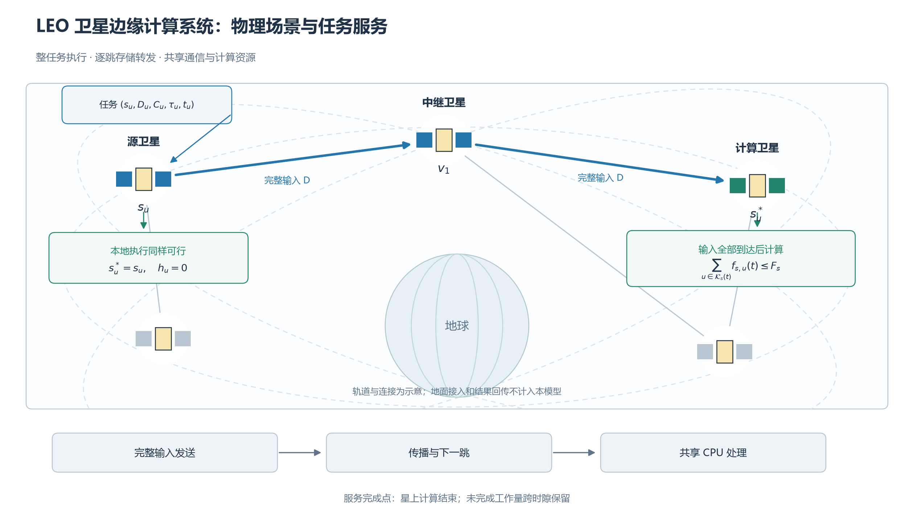
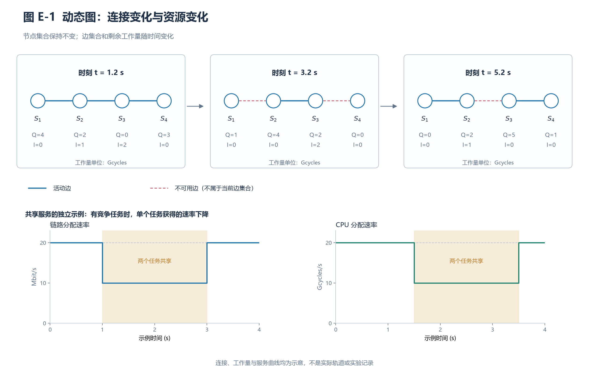
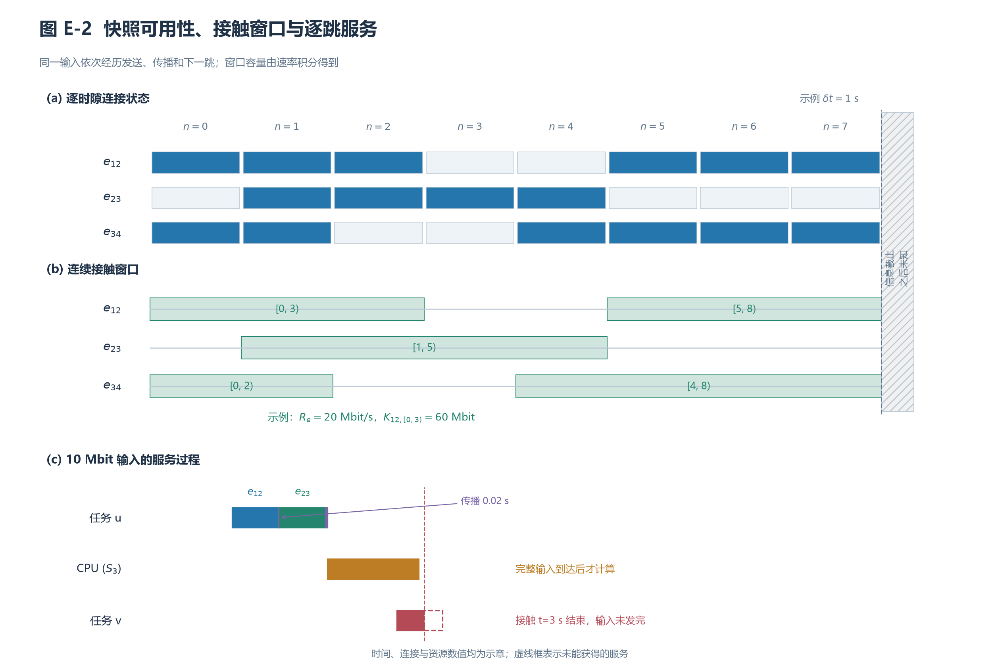

# 系统模型

本文考虑由多颗低地球轨道（low Earth orbit，LEO）卫星组成的星上边缘计算系统。卫星集合记为 $\mathcal S=\{0,\ldots,S-1\}$，每颗卫星均搭载星上服务器，并通过星间链路（inter-satellite link，ISL）交换任务输入。该系统面向输入已位于源卫星的处理业务，例如星上采集数据的处理，或已完成地面上行的任务处理。由于任务到达在空间上不均匀、卫星算力存在差异，源卫星可能在其他卫星仍有余量时出现负载积累，因此需要协同决定任务执行位置、传输路径及资源分配。

任务可以在源卫星执行，也可以将完整输入经 ISL 传送到另一颗卫星执行。本文的服务完成点为星上计算结束，不包含地面接入与结果回传。因此，后续时延是星间卸载与星上处理时延，不是包含地面终端收发的全流程业务时延。任务不可拆分，不进行执行中重路由或计算迁移；暂不建模存储容量、星上能耗及控制信令开销。

任务到达阶段包含 $N$ 个时隙，时隙长度为 $\delta t$，边界为 $t_n=n\delta t$。任务在边界集中到达并进行调度，传输、传播和计算则在时隙内按连续时间事件推进。到达结束后，继续排空至所有任务终止或达到最多 $N_d$ 个排空时隙。逻辑控制器可获取当前拓扑、任务与资源状态以及有限轨道前视信息，但不能读取未来任务到达。以下依次建立网络、任务、动态资源与时延、接触窗口及联合优化问题。

## A. 卫星网络与轨道运动模型

采用圆轨道二体运动下的 Walker-Delta 星座。设轨道面数为 $P$，每面卫星数为 $J$，则 $S=PJ$。对面编号 $p$ 和面内编号 $j$，定义

$$
\Omega_p=\frac{2\pi p}{P},\qquad
\psi_{p,j}=\frac{2\pi j}{J}+\frac{2\pi F_Wp}{PJ},
\qquad r_{\rm orb}=R_E+h.
$$

其中，$F_W$ 为相位因子，$h$ 为轨道高度，$R_E$ 为地球半径。令 $\mu_E$ 为地球引力参数，平均角速度与轨道周期为

$$
\nu=\sqrt{\frac{\mu_E}{r_{\rm orb}^3}},\qquad
T_{\rm orb}=\frac{2\pi}{\nu},\qquad
\vartheta_{p,j}(t)=\psi_{p,j}+\nu(t+t_{\rm epoch}).
$$

其中，$t_{\rm epoch}\ge0$ 为观测时域相对轨道参考历元的起始偏移，在一个观测时域内保持固定。不同起始偏移对应同一 Walker 星座在不同轨道时刻的位置，不改变轨道面、卫星间相位关系、高度或倾角；$t_{\rm epoch}=0$ 为原参考历元。

在轨道倾角 $i$ 下，卫星的地心惯性坐标为

$$
\mathbf q_{p,j}(t)=r_{\rm orb}
\begin{bmatrix}
\cos\Omega_p\cos\vartheta_{p,j}(t)-\sin\Omega_p\sin\vartheta_{p,j}(t)\cos i\\
\sin\Omega_p\cos\vartheta_{p,j}(t)+\cos\Omega_p\sin\vartheta_{p,j}(t)\cos i\\
\sin\vartheta_{p,j}(t)\sin i
\end{bmatrix}.
$$

实现于各时隙边界采样位置 $\mathbf q_s[n]=\mathbf q_s(t_n)$，据此更新拓扑；相邻边界之间使用分段固定的网络快照。该模型保留轨道驱动的连接变化，同时允许资源服务在快照内连续演化。

允许建立同一轨道面内相邻卫星之间，以及相邻轨道面卫星之间的链路。设 $d_{ij}[n]=\|\mathbf q_i[n]-\mathbf q_j[n]\|$，链路必须满足最大通信距离与地球遮挡约束：

$$
d_{ij}[n]\le d_{\rm ISL}^{\max},\qquad
\min_{\zeta\in[0,1]}
\|\mathbf q_i[n]+\zeta(\mathbf q_j[n]-\mathbf q_i[n])\|
>R_E+h_{\rm clr}.
$$

其中，$h_{\rm clr}$ 为地球遮挡的安全余量。跨轨链路还满足配置的纬度限制。先连接符合条件的面内相邻卫星，再将符合条件的跨面链路按距离升序接入，并限制每颗卫星的链路度数不超过 $d_{\max}$。得到无向网络快照

$$
G[n]=(\mathcal S,\mathcal E[n]).
$$

连接规则为给定的物理网络规则，卸载策略不改变轨道或 ISL 连接。网络不额外补造链路以保证连通。活动链路 $e=\{i,j\}$ 的任务业务速率预算记为 $R_e[n]$，默认在连接存在时取配置容量；距离影响连接条件与传播时延，不额外引入无线衰落模型。

## B. 任务到达与整任务卸载模型

令 $\mathcal U[n]$ 为时隙 $n$ 的到达任务集合，$\lambda_{\rm arr}$ 为平均每秒到达数，则

$$
N_n^{\rm arr}=|\mathcal U[n]|
\sim \operatorname{Poisson}(\lambda_{\rm arr}\delta t).
$$

不同到达时隙独立采样。任务到达时刻量化为时隙边界，而非在时隙内部采样连续到达时刻。排空阶段不再生成任务。

对任务 $u$，定义

$$
\mathcal T_u=(s_u,D_u,C_u,\tau_u,t_u),\qquad
W_u=D_uC_u,\qquad t_u=t_n,\quad u\in\mathcal U[n],
$$

其中，$s_u$ 为源卫星，$D_u$ 为输入数据量（bit），$C_u$ 为计算密度（cycles/bit），$W_u$ 为总计算量（cycles），$\tau_u$ 为相对期限（s）。绝对截止时刻为 $t_u+\tau_u$。当前业务参数采用相互独立的均匀分布：

$$
D_u\sim\mathcal U(D_{\min},D_{\max}),\qquad
C_u\sim\mathcal U(C_{\min},C_{\max}),\qquad
\tau_u\sim\mathcal U(\tau_{\min},\tau_{\max}).
$$

设热点卫星集合为 $\mathcal H$，热点混合概率为 $p_h$，源卫星分布为

$$
\Pr(s_u=s)=\frac{1-p_h}{S}
+\frac{p_h}{|\mathcal H|}\mathbf1\{s\in\mathcal H\}.
$$

热点实际任务份额为 $p_h+(1-p_h)|\mathcal H|/S$，包含均匀到达分量。卫星计算容量在系统初始化时独立采样一次：

$$
F_s\sim\mathcal U(F_{\min},F_{\max}),
$$

并在该次运行中保持不变。$F_s$ 表示有效 CPU cycles/s，与 GFLOPS 不直接等价。上述分布和资源预算是可复现的仿真假设，尚不代表实测业务分布或硬件标定。

任务完整地执行于一颗卫星。定义实际执行关联

$$
a_{u,s}\in\{0,1\},\qquad
\sum_{s\in\mathcal S}a_{u,s}=1,
$$

并以 $s_u^*$ 表示满足 $a_{u,s_u^*}=1$ 的计算卫星。传输路径为

$$
\mathcal P_u=(v_{u,0},\ldots,v_{u,h_u}),\qquad
v_{u,0}=s_u,\quad v_{u,h_u}=s_u^*.
$$

本地执行对应 $s_u^*=s_u$、$h_u=0$。远程路径无环，提交时各边属于当前图，跳数不超过 $H_p$。路径上的中继只转发输入，全部计算在 $s_u^*$ 进行。

## C. 动态资源共享模型

每条 ISL 使用一个无向容量预算，两个传输方向共同消耗该预算。设 $\mathcal T_e(t)$ 为时刻 $t$ 正在链路 $e$ 发送的任务集合，任务获得速率 $r_{u,e}(t)$，则

$$
\sum_{u\in\mathcal T_e(t)}r_{u,e}(t)\le R_e(t),\qquad
r_{u,e}(t)\ge0.
$$

其中，$R_e(t)=R_e[n]$，$t\in[t_n,t_{n+1})$；不可用链路的容量为零。$u\notin\mathcal T_e(t)$ 时令 $r_{u,e}(t)=0$。任务只占用当前跳的实际发送资源，后续跳不提前占用真实容量，传播阶段也不占用发送容量。

设 $\mathcal K_s(t)$ 为输入已完整到达且正在卫星 $s$ 计算的任务集合。分配 CPU 速率 $f_{s,u}(t)$ 满足

$$
\sum_{u\in\mathcal K_s(t)}f_{s,u}(t)\le F_s,\qquad
f_{s,u}(t)\ge0.
$$

若 $u\notin\mathcal K_s(t)$，则 $f_{s,u}(t)=0$。当前执行机制为处理器共享：活动发送任务与计算任务同时服务，分配在活动集合或拓扑发生变化时更新。它不是逐任务 FIFO 串行执行。

令 $d_u^{\rm rem}(t)$ 为当前跳剩余 bit，$w_u^{\rm rem}(t)$ 为剩余 cycles。在对应服务阶段，

$$
\frac{d}{dt}d_u^{\rm rem}(t)=-r_{u,e}(t),\qquad
\frac{d}{dt}w_u^{\rm rem}(t)=-f_{s_u^*,u}(t).
$$

每跳开始时 $d_u^{\rm rem}$ 重置为 $D_u$，计算开始前 $w_u^{\rm rem}=W_u$。在任意服务区间 $[t_a,t_b]$，剩余量由原剩余量减去分配速率的积分得到；这些剩余量跨时隙保留。

计算驻留工作量、在途承诺计算量与链路发送积压分别定义为

$$
Q_s(t)=\sum_{u\in\mathcal K_s(t)}w_u^{\rm rem}(t),
$$

$$
I_s(t)=
\sum_{\substack{u:\,s_u^*=s\\u\text{ 处于发送或传播阶段}}}
w_u^{\rm rem}(t),\qquad
B_e^{\rm tx}(t)=\sum_{u\in\mathcal T_e(t)}d_u^{\rm rem}(t).
$$

$I_s$ 不包含已经进入 $\mathcal K_s$ 的任务。$Q_s/F_s$、$I_s/F_s$ 是资源负载的时间尺度，不能作为额外 FIFO 等待时延叠加到真实完成时延。

## D. 存储转发与实际任务时延

输入采用逐跳存储转发，每一跳均发送完整 $D_u$ bit。令 $a_{u,\ell}^{\rm tx}$ 为第 $\ell$ 跳开始发送的时刻，$b_{u,\ell}^{\rm tx}$ 为发送完成时刻，$e_{u,\ell}=\{v_{u,\ell-1},v_{u,\ell}\}$。对成功完成该跳的任务，

$$
b_{u,\ell}^{\rm tx}=
\inf\left\{
t\ge a_{u,\ell}^{\rm tx}:
\int_{a_{u,\ell}^{\rm tx}}^t r_{u,e_{u,\ell}}(\xi)\,d\xi
\ge D_u
\right\}.
$$

第 $\ell$ 跳传播时延为

$$
T_{u,\ell}^{\rm prop}
=\frac{d_{v_{u,\ell-1},v_{u,\ell}}[n_{u,\ell}^{\rm ref}]}{c_0},
$$

其中，$c_0$ 为光速。$n_{u,\ell}^{\rm ref}$ 取发送完成前最后一个服务区间所在的拓扑快照；发送恰在边界完成时使用边界之前的快照。发送结束后固定该传播时延。

逐跳到达时刻满足

$$
a_{u,1}^{\rm tx}=t_u,\qquad
a_{u,\ell+1}^{\rm tx}
=b_{u,\ell}^{\rm tx}+T_{u,\ell}^{\rm prop}.
$$

输入到达计算卫星的时刻为

$$
a_u^{\rm cpu}=
\begin{cases}
t_u,&h_u=0,\\
b_{u,h_u}^{\rm tx}+T_{u,h_u}^{\rm prop},&h_u>0.
\end{cases}
$$

仅当输入全部到达时才启动计算。对完成任务，

$$
t_u^{\rm done}
=\inf\left\{
t\ge a_u^{\rm cpu}:
\int_{a_u^{\rm cpu}}^t f_{s_u^*,u}(\xi)\,d\xi\ge W_u
\right\}.
$$

于是

$$
T_u=t_u^{\rm done}-t_u
=\sum_{\ell=1}^{h_u}
\left(b_{u,\ell}^{\rm tx}-a_{u,\ell}^{\rm tx}
+T_{u,\ell}^{\rm prop}\right)
+t_u^{\rm done}-a_u^{\rm cpu}.
$$

竞争通过时变分配速率影响服务区间长度，因此不再添加独立排队项。任务在发送阶段遭遇断链时终止为路由失败；发送已完成后的传播无需前一链路继续保持可用。上述完成时刻公式不为失败或截尾任务构造虚假完成时间。

按期成功定义为任务完成且 $T_u\le\tau_u$。默认情况下，任务仍活动且达到期限时记录一次违约，随后继续执行；恰在期限完成的任务视为成功。排空上限处仍活动的任务标记为截尾。完成时延仅对完成任务定义；成功、违约、断链失败和截尾描述不同的任务结果。

## E. 资源状态与接触窗口的动态图

将轨道驱动的连接变化和业务驱动的资源变化统一表示为

$$
\mathcal G(t)=
\left(\mathcal S,\mathcal E(t),
\mathbf X_{\mathcal S}(t),\mathbf X_{\mathcal E}(t)\right),
\qquad n(t)=\lfloor t/\delta t\rfloor.
$$

节点集合固定为物理卫星，$\mathcal E(t)=\mathcal E[n(t)]$ 随网络快照变化。节点与链路属性分别为

$$
\mathbf x_s(t)=
\left(F_s,Q_s(t),I_s(t),\mathbf q_s[n(t)]\right),
\qquad
\mathbf x_e(t)=
\left(R_e(t),d_e[n(t)],B_e^{\rm tx}(t)\right).
$$

$F_s$ 在单次运行中固定，而 $Q_s,I_s,B_e^{\rm tx}$ 随任务到达、发送、传播和计算完成而变化。因此，同一时刻的可达性由边集合决定，传输与处理持续时间还取决于资源占用；即使两次观察具有相同边集合，任务完成时延也可能不同。

**图 E-1：动态卫星图的连接与资源状态。** 三个时刻使用相同卫星集合，但活动边不同；节点下方给出计算驻留量 $Q_s$ 和在途量 $I_s$ 的示例。下方进一步说明同一链路和计算节点的活动集合变化如何影响服务。图中连接及数值均为模型示意，不是轨道或实验记录。

对于链路 $e$，将一段观察范围内连续可用的快照合并成接触窗口：

$$
\mathcal C_e[n]=
\left\{[\beta_{e,k},\varepsilon_{e,k})\right\}_k,
\qquad
K_{e,k}=
\int_{\beta_{e,k}}^{\varepsilon_{e,k}}R_e(t)\,dt.
$$

$\beta_{e,k}$ 和 $\varepsilon_{e,k}$ 分别表示窗口起点与终点，$K_{e,k}$ 为该窗口的总业务容量。它是所有共享任务的总预算，不是单个任务可独占的容量。

时隙 $n$ 的轨道信息包括当前及后续 $H$ 个快照；轨道记录足够长时，已知区间为 $[t_n,t_n+(H+1)\delta t)$。只在已知区间内确定接触存在与否；若某窗口延伸至观察边界，该边界表示信息截止，不能认定为真实断链时刻。轨道信息不包含未来任务到达或未来资源占用。

**图 E-2：快照可用性对应的接触窗口及输入服务过程。** 上部将逐时隙连接状态合并为连续窗口；窗口中的容量面积为 $\int R_e(t)\,dt$。下部给出同一输入先发送、再传播、再进入下一跳的过程，并对比因接触结束而无法完成发送的情况。图中时间和速率只用于解释模型。

对一个在窗口 $[\beta,\varepsilon)$ 内开始并成功完成发送的任务，第 $\ell$ 跳必须满足

$$
\beta\le a_{u,\ell}^{\rm tx}
<b_{u,\ell}^{\rm tx}\le\varepsilon,\qquad
\int_{a_{u,\ell}^{\rm tx}}^{b_{u,\ell}^{\rm tx}}
r_{u,e_{u,\ell}}(t)\,dt=D_u.
$$

由资源容量约束可得必要条件

$$
D_u\le
\int_{a_{u,\ell}^{\rm tx}}^\varepsilon
R_{e_{u,\ell}}(t)\,dt.
$$

该条件只表示窗口总容量足够；有其他任务共享时，单个任务获得的积分服务仍可能不足。发送结束后的传播可以延伸到该链路接触结束之后；下一跳则必须在其自身的可用窗口中进行。当前拓扑可达不等于整个任务执行期间持续可达。

## F. 系统成本与联合优化问题

令 $\mathcal A(t)$ 为尚未终止的活动任务集合，$A(t)=|\mathcal A(t)|$。时隙持有成本为

$$
H_n=\int_{t_n}^{t_{n+1}}A(t)\,dt.
$$

令 $t_u^{\rm term}$ 为任务完成、断链失败或排空截尾时的终止时刻，则

$$
\sum_nH_n=\sum_u(t_u^{\rm term}-t_u).
$$

它包含所有任务终止前的驻留时间，不是仅完成任务的平均时延。设 $M_n$ 为本时隙首次记录的期限违约数，$J_n$ 为实际断链失败数，系统成本定义为

$$
C_n^{\rm sys}=H_n+\alpha_dM_n+\alpha_fJ_n.
$$

$\alpha_d,\alpha_f$ 单位为 s，分别控制对期限违约和服务失败的重视程度。已违约但继续执行的任务仍产生持有成本；若该任务随后断链，也记录实际失败。截尾任务保留其终止前的驻留时间，不构造计算完成时延。

定义执行关联 $A=\{a_{u,s}\}$、路径 $\mathscr P=\{\mathcal P_u\}$、链路速率 $\mathsf R=\{r_{u,e}(t)\}$ 和 CPU 速率 $\mathsf F=\{f_{s,u}(t)\}$。因果决策机制 $\Pi$ 根据可用信息确定这些变量，原始系统问题为

$$
\text{(P1)}:\quad
\min_{\Pi\in\mathfrak P_{\rm causal}}
\mathbb E_\Pi\left[
\sum_{n=0}^{N+N_d-1}C_n^{\rm sys}
\right],
$$

$$
\begin{aligned}
\text{s.t.}\quad
&a_{u,s}\in\{0,1\},\qquad \sum_sa_{u,s}=1,\\
&v_{u,0}=s_u,\quad a_{u,v_{u,h_u}}=1,\quad 0\le h_u\le H_p,\\
&v_{u,\ell}\ne v_{u,k}\quad(\ell\ne k),\\
&e_{u,\ell}\in\mathcal E[n_u],\quad \ell=1,\ldots,h_u,\\
&\sum_{u\in\mathcal T_e(t)}r_{u,e}(t)\le R_e(t),\quad r_{u,e}(t)\ge0,\\
&\sum_{u\in\mathcal K_s(t)}f_{s,u}(t)\le F_s,\quad f_{s,u}(t)\ge0,\\
&r_{u,e}(t)=0\ (u\notin\mathcal T_e(t)),\\
&f_{s,u}(t)=0\ (u\notin\mathcal K_s(t)),\\
&a_{u,\ell+1}^{\rm tx}
=b_{u,\ell}^{\rm tx}+T_{u,\ell}^{\rm prop}
\quad\text{对成功完成的前一跳},\\
&\text{输入全部到达后计算，剩余工作量按 C、D 节演化},\\
&\text{执行位置和路径在到达时确定，任务执行中保持不变},\\
&\Pi\text{ 仅使用当前/历史状态及规定范围内的轨道信息}.
\end{aligned}
$$

$n_u$ 为到达时隙，所有路径边在提交时存在。之后的可用性仍由轨道决定；发送阶段断链按失败终止，不要求所有已提交路径均能在未来执行成功。若排空提前结束，之后成本按零延拓到上述时域上限。期限通过违约成本表示，不将 $T_u\le\tau_u$ 作为所有任务必须满足的硬约束。

执行位置与路径是离散变量，服务速率是时变连续变量；当前选择还改变后续资源竞争和驻留工作量。P1 描述这些变量在容量、服务顺序和信息因果性约束下的联合目标。

## G. 主要符号

| 符号 | 含义 / 单位 |
|---|---|
| $\mathcal S,\mathcal E[n]$ | 卫星集合、时隙 ISL 集合 |
| $\delta t,N,N_d$ | 时隙长度（s）、到达时隙数、最大排空时隙数 |
| $s_u,s_u^*$ | 源卫星、实际计算卫星 |
| $D_u,C_u,W_u,\tau_u$ | bit、cycles/bit、cycles、s |
| $\mathcal P_u,H_p$ | 传输路径、最大路径跳数 |
| $R_e,r_{u,e}$ | 链路预算、任务分配速率（bit/s） |
| $F_s,f_{s,u}$ | 计算预算、任务分配速率（cycles/s） |
| $Q_s,I_s,B_e^{\rm tx}$ | 驻留 cycles、在途 cycles、发送积压 bit |
| $\mathcal C_e,H,K_{e,k}$ | 接触窗口集合、后续快照数、窗口容量 bit |
| $T_u,H_n,C_n^{\rm sys}$ | 完成时延、持有成本、系统时隙成本（s） |
| $M_n,J_n$ | 新期限违约数、实际断链失败数 |
